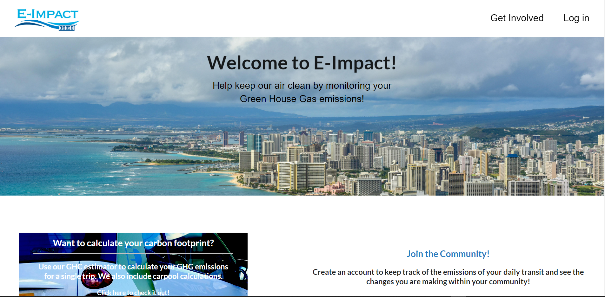
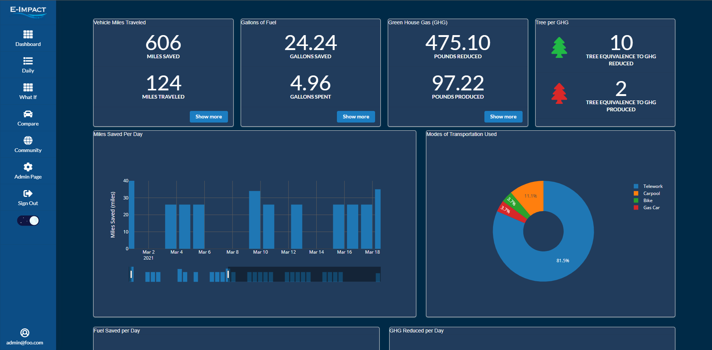
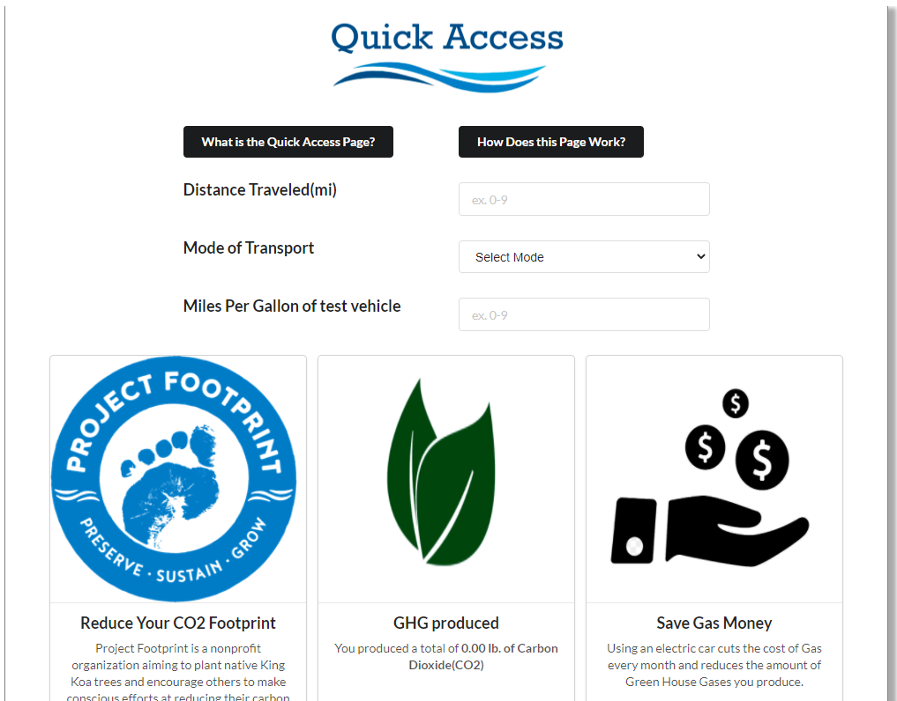

# Table of Contents

* [Introduction](#Introduction)
* [Goal](#Goal)
* [Team Members](#Team-Members)

# Introduction 
Environment Overflow is a student software engineering team based at the University of Hawaii at Manoa. During the spring of 2021, we aim to complete a client request project within three months and this home page will be updated as we progress. As a team, we hope to produce a project that per the request of our client can benefit the community in an impactful way. Thank you. 

# Goal
The goal of this team project is to produce an application with the intent to spark interest regarding the issues of climate change. While tackling the whole issue of climate change during a three-month time frame is quite extreme, we humbly narrow our focus to one specific area of study, vehicles and their use of fossil fuels. Our team goal is to produce an application that is both informative and interactive, something that has an impact that engages the community to produce a positive change.  
Our goal for the application includes the ability for our users to track personal and community level impacts on the statistical values surrounding greenhouse gas emissions. We aim to provide relevant data in the form of close approximations and graphical tools to help our users visualize what kind of an impact they are truly having. 

# Mockup Pages

## Landing Page

This is the pages all users will be greeted with. Here they can learn a little bit about the site and sign in to their account or create a new one

## Login Page

This is the login page that allows returning users to sign in to their account.

## Dashboard

Here we wlil show signed in users their personalized graphs and charts with their data that they enter.

## Add Trip

On this page the users can log a transportation trip in order to see the resulting graphs/charts. We've added the ability to save trips and here they can now select the saved trip to add, to save some time, and make sure you don't enter anything incorrectly by accident.

## Community Page

A page where other users can see the total GHG detail for all users within a zipcode and all users using the application.

We also allow our users to click on the provided links to learn more about how they can help save the environment.

## Daily Page

Shows their daily inputted data with formulas that show how much GHG the user produced/saved, etc.

## Admin Page

Here an Admin can look at all the users and their trips and delete anything necessary based on suspicious activity etc.

## Quick Access

Quick access is accessible from the landing page and will give users who haven't signed up a taste of what lies inside.

## Get Involved

This page is also accessible from the landing page and gives more information as well as links to other organizations that are helping our planet be more eco-friendly.

# Use Case

This site is designed for people who are already interested in their environmental impact as well as getting people who aren't yet  interested, interested. Here they can see their impact as well as compare it to others in their community. Hopefully this will encourage people to be more environmentally friendly with the things they do in their everyday lives.

# Team Members
Environment Overflow is a student-run team including the following:  
[Jake Camarao](https://jcamarao.github.io/).  
[James K Lau](https://jklaulau.github.io/).  
[Justin Mar](https://justin-mar.github.io/).  
[Kameron Wong](https://wongk711.github.io/).  
[Nicholas Miyamoto-Pennywell](https://nicholasmp.github.io/).  
[Louella Caraang](https://lcaraang.github.io/).  
[Rexter Delos Santos](https://rexter-ds.github.io/).  
[Tiffany Williams](https://tiffanywilliams.github.io/).  

 
